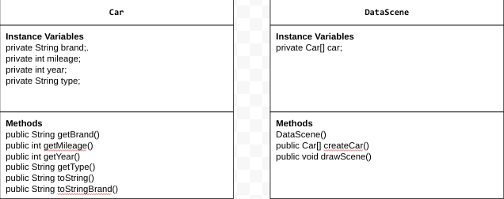

# Unit 4 - Abstract Art Project

## Introduction

Data visualizations are powerful tools to present information and convey patterns and relationships. Sometimes visualizations are charts or graphs, and other times they are more abstract pieces of art. Your goal is to create a visual representation relating at least two categories from your dataset that engages your viewer and encourages them to learn more about your chosen topic.

## Requirements

Use your knowledge of object-oriented programming, one-dimensional (1D) arrays, and algorithms to create your data visualization program:

- **Create at least two 1D arrays** – Create at least two 1D arrays to store the data that will make up your visualization.
- **Implement one or more algorithms** – Implement one or more algorithms that use two-way or multi-selection statements with compound Boolean expressions to analyze the data.
- **Use methods in the Math class** – Use one or more methods in the Math class in your program, such as to perform calculations on the values in your dataset and display the results, choose random values from the dataset, or display images or shapes at random locations.
- **Create a visualization** – Create an image or animation that conveys the story of the data by illustrating the patterns or relationships in the data.
  Note: This may be abstract! Others do not necessarily need to know what the story or pattern is right away, but you do need to be able to explain it to them.
- **Document your code** – Use comments to explain the purpose of the methods and code segments and note any preconditions and postconditions.

## Dataset

Dataset: https://docs.google.com/spreadsheets/d/1ntl588TTtYCebQkxn-oVEcmrQ-FQqV4tXHJHqM1v5o0/edit?usp=sharing 

- **Brand** (String) - The manufacturer or brand name of the car (e.g., Toyota, Ford)
- **Mileage** (int) - The distance the car has traveled in total
- **Year** (int) - The manufacturing year of the car.
- **Type** (String) - The category of the car (e.g., sedan, SUV, truck).

## UML Diagram

## Video Demo

[![My project's thumbnail])](https://youtu.be/019QzDTZC6o)

## Description

In our project, we created a car data analysis program to help a car enthusiast compare different cars based on their brand, mileage, year, and type. The User Story focuses on making it easy to analyze car details for decision-making. We used a dataset with columns like Brand, Mileage, Year, and Type, which were stored in 1D arrays. Each car was represented as an object with instance variables for these attributes.

The program uses object-oriented programming concepts like classes, constructors, and methods to process and display the data. For example, We included a method to calculate random mileage between a car's minimum and maximum range. Our project also used the toString() method to display car details clearly.

Although We didn’t use the Scanner class for user input, the program automatically selects and displays random car data to keep it simple and user-friendly. By focusing on concepts like array traversal and file reading methods, the project meets the user's goal of making car data easy to compare.
